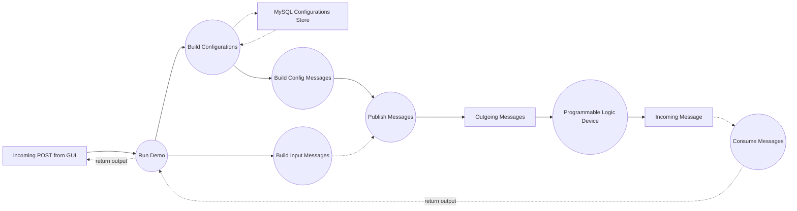
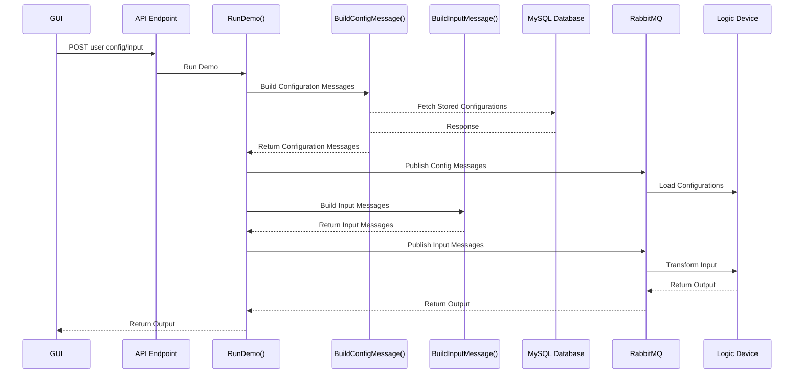

# go-brain
api and rabbit pubsub

Data Flow

```mermaid
graph LR
    gui[incoming POST from GUI]-->demo((Run Demo))
    demo-->cfg((Build Configurations))
    cfg-.->db[MySQL Configurations Store]
    db-.->cfg
    cfg-->rmq((Build Config Messages))
    rmq-->pub((Publish Messages))
    pub-->msg[Outgoing Messages]
    msg-->logic((Programmable Logic Device))
    demo-->input((Build Input Messages))
    input-.->pub
    logic-->output[Incoming Message]
    output-.->cns((Consume Messages))
    cns-. return output -.->demo
    demo-. return output -.->gui
```

Sequence Diagram

```mermaid
sequenceDiagram 
    participant gui as GUI
    participant api as API Endpoint
    participant demo as RunDemo()
    participant cfg as BuildConfigMessage()
    participant input as BuildInputMessage()
    participant db as MySQL Database
    participant rmq as RabbitMQ
    participant logic as Logic Device
    
    gui->>api: POST user config/input
    api->>demo: Run Demo
    demo->>cfg: Build Configuraton Messages
    cfg-->>db: Fetch Stored Configurations
    db-->cfg: Response
    cfg-->>demo: Return Configuration Messages
    demo->>rmq: Publish Config Messages
    rmq->>logic: Load Configurations
    demo->>input: Build Input Messages
    input-->>demo: Return Input Messages
    demo->>rmq: Publish Input Messages
    rmq->>logic: Transform Input
    logic-->>rmq: Return Output
    rmq-->>demo: Return Output
    demo-->>gui: Return Output
```